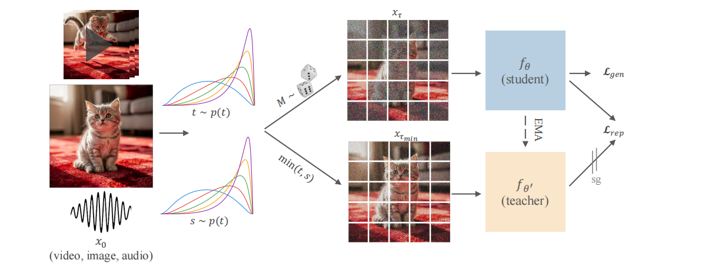

# SelfFlow-FLUX2

Unofficial open-source reimplementation of Self-Flow for FLUX.2 full-parameter training, built on DiffSynth-Studio.

[Black Forest Labs](https://github.com/black-forest-labs/Self-Flow/) (the official team behind FLUX.2) has not yet open-sourced their code. 
This project is based on their inference code. Thanks to their contribution!



## Installation

Install from source (recommended):

```
git clone https://github.com/modelscope/DiffSynth-Studio.git  
cd DiffSynth-Studio
pip install -e .
```

For more installation methods and instructions for non-NVIDIA GPUs, please refer to the [Installation Guide](/docs/en/Pipeline_Usage/Setup.md).
